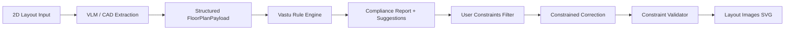

# Intelligent 2D Layout Pipeline

End-to-end workflow matching your product vision:

**2D layout in → AI extraction → Vastu compliance → report + suggestions → constrained perfect layout image out**

## Pipeline stages



| Stage | Module | Output |
|-------|--------|--------|
| 1 — Extract | `VlmLayoutExtractor` | `LayoutExtractionResult` (rooms, walls, doors, windows) |
| 2 — Compliance | `CompliancePipeline` | `ComplianceReport` (score, rules, recommendations) |
| 3 — Constraints | `UserConstraintEngine` | Locked rooms / max move limits |
| 4 — Correct | `GhostOverlayEngine` + `CorrectedLayoutBuilder` | `CorrectedLayoutResult` |
| 5 — Validate | `UserConstraintEngine` | `ConstraintValidationResult` |
| 6 — Visualize | `LayoutImageRenderer` | SVG original / corrected / comparison |

## Input options

### A) 2D image (VLM)

```json
POST /api/v1/intelligent/analyze
{
  "image_base64": "<base64 PNG/JPG of floor plan>",
  "true_north_degrees": 0,
  "user_constraints": [
    {
      "constraint_id": "keep-master",
      "kind": "fixed_room",
      "room_id": "r-master",
      "reason": "Client wants master bedroom unchanged"
    }
  ]
}
```

Requires `OPENAI_API_KEY` for GPT-4o vision extraction.

### B) Structured CAD payload (no VLM)

```json
{
  "payload": { "elements": [ "...rooms/walls from Revit/AutoCAD..." ] },
  "user_constraints": [ ... ]
}
```

## User constraints (validator)

| Kind | Behavior |
|------|----------|
| `fixed_room` | Room polygon must not move during correction |
| `fixed_zone` | Room must remain in specified Vastu zone |
| `max_move` | Allow correction but cap translation (feet) |
| `preserve_room_type` | Lock all rooms of a given type |
| `preserve_element` | Reserved for wall/door lock (future) |

Violations appear in `constraint_validation.violations[]`. Skipped rooms appear in `skipped_corrections[]`.

## Response structure

```json
{
  "extraction": { "elements": [], "confidence_score": 0.92, "payload": {} },
  "report": { "summary": {}, "recommendations": [], "corrected_layout": {} },
  "corrected_layout": { "corrected_payload": {}, "changes_applied": [] },
  "constraint_validation": { "valid": true, "locked_room_ids": ["r-master"] },
  "layout_images": {
    "original": { "format": "svg", "content": "<svg>...</svg>" },
    "corrected": { "format": "svg", "content": "..." },
    "comparison": { "format": "svg", "content": "..." }
  },
  "pipeline_stages": ["extract_layout", "vastu_compliance", "constrained_correction", "render_layout_images", "complete"]
}
```

## Design principles

1. **VLM extracts geometry only** — never decides Vastu pass/fail
2. **Rules engine is deterministic** — YAML rules + compass zones
3. **LLM enriches explanations** — optional, does not change scores
4. **User constraints override suggestions** — fixed rooms stay fixed
5. **Images are derived artifacts** — safe new SVG files, source layout untouched

## Related files

```
app/services/extraction/vlm_layout_extractor.py
app/services/constraints/user_constraints.py
app/services/pipeline/intelligent_layout_pipeline.py
app/services/visualization/layout_image_renderer.py
app/api/routes/intelligent.py
tests/test_intelligent_pipeline.py
```
