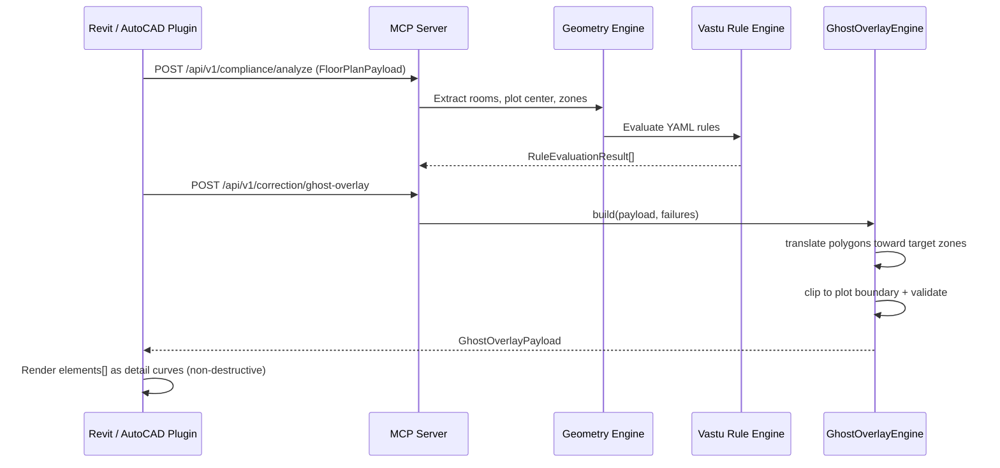
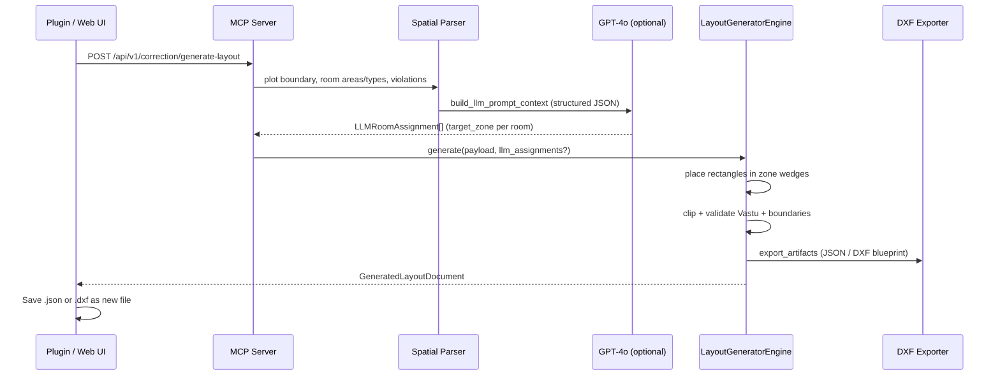

# Layout Auto-Correction Engine — Technical Architecture

This document describes how the Vastu Compliance MCP Server solves layout problems **visually** without modifying the user's source Revit (`.rvt`) or AutoCAD (`.dwg`) files.

## Problem

Autodesk APIs and data-safety policies prevent direct, unattended mutation of customer source models. The correction engine therefore operates on **derived geometry** that plugins render as overlays or export as **new files**.

## Two Bypass Strategies

| Approach | Output | Source file touched? | User action |
|----------|--------|----------------------|-------------|
| **1 — Ghost Overlay** | `GhostOverlayPayload` JSON | No | Preview cyan/gold overlay in Revit/AutoCAD; optionally apply manually |
| **2 — AI Layout Generator** | `GeneratedLayoutDocument` (+ optional DXF) | No | Save/import new layout file side-by-side with original |

---

## Approach 1: Ghost Overlay System (Non-Destructive)

### High-level flow



### Server modules

| Module | Role |
|--------|------|
| `app/services/correction/transforms.py` | Polygon translation, zone vectors, boundary clip |
| `app/services/correction/ghost_overlay.py` | Builds `GhostOverlayPayload` |
| `app/services/correction/constraint_validator.py` | Ensures corrected geometry stays inside plot |
| `revit-plugin/.../GhostDesignRenderer.cs` | Existing Revit consumer (translation-based preview) |

### Ghost geometry packaging

The MCP server sends **`GhostOverlayPayload`** (JSON Schema: `config/schemas/ghost_geometry.schema.json`):

1. **`metadata`** — coordinate system (`plan_xy_y_north`), units, plot center/boundary, plugin render hints.
2. **`room_corrections[]`** — per-room original vs corrected polygons, zone delta, translation vector.
3. **`elements[]`** — drawable primitives for the viewer:
   - `room_polygon` — corrected outline (+ original for diff)
   - `shift_arrow` — centroid → proposed centroid
   - `label` — room name + target zone
   - `zone_compass` — 8-spoke Vastu compass at plot center

### Plugin rendering contract

```json
{
  "element_id": "ghost-room-r1",
  "kind": "room_polygon",
  "geometry": {
    "type": "Polygon",
    "coordinates": [[{"x": 12, "y": 8}, "..."]],
    "original_coordinates": [[{"x": 10, "y": 5}, "..."]]
  },
  "style": "cyan_dashed",
  "metadata": { "translation": {"x": 2.0, "y": 3.0, "z": 0.0} }
}
```

Revit maps this to `DetailCurve` + `OverrideGraphicSettings` (see `GhostDesignRenderer.cs`). AutoCAD maps to transient entities on layer `VASTU_GHOST`.

---

## Approach 2: AI Layout Generator (New Instance)

### High-level flow



### Spatial parsing (deterministic baseline)

From `FloorPlanPayload`:

1. **Plot boundary** — convex hull of all room polygons.
2. **Plot center / radius** — Shapely union centroid + max corner distance.
3. **Room catalog** — id, name, `room_type`, area, current zone, rule violations.
4. **Constraints** — YAML preferred/avoid zones, Brahmasthan exclusion, min areas.

### LLM integration (structured stitch-back)

The server exposes `llm_prompt_context` in `GenerateLayoutResponse`. The LLM returns:

```json
[
  {"room_id": "r-kitchen", "target_zone": "south_east", "relative_position": {"radius_fraction": 0.55}},
  {"room_id": "r-master", "target_zone": "south_west", "relative_position": {"radius_fraction": 0.6}}
]
```

`LayoutGeneratorEngine` stitches assignments into concrete polygons via `zone_target_point()` + `rectangle_for_area()`, then re-runs the deterministic rule engine to compute the new compliance score.

Without LLM input, the engine uses rule `expected_zones` and Vastu catalog `recommended_uses` as fallback placement.

### Export formats

| Format | Artifact key | Description |
|--------|--------------|-------------|
| `vastu_layout_json` | `export_artifacts.vastu_layout_json` | Full `GeneratedLayoutDocument` |
| `dxf` | `export_artifacts.dxf` | ezdxf blueprint (`layers`, `entities`) |

JSON Schema: `config/schemas/generated_layout.schema.json`

---

## API Endpoints

| Method | Path | Request | Response |
|--------|------|---------|----------|
| POST | `/api/v1/correction/ghost-overlay` | `GenerateGhostOverlayRequest` | `GenerateGhostOverlayResponse` |
| POST | `/api/v1/correction/generate-layout` | `GenerateLayoutRequest` | `GenerateLayoutResponse` |

Both endpoints accept an optional pre-computed `orientations` + `rule_results`; otherwise they run the compliance pipeline internally.

---

## Approach 3: Same 2D Layout With Suggestions Applied

When violations exist, every compliance analysis now also returns **`corrected_layout`** — the **same floor plan** (same room IDs, names, types) with suggestion geometry applied to room polygons.

| Field | Description |
|-------|-------------|
| `corrected_payload` | Full `FloorPlanPayload` with `source: "vastu_corrected_2d"` |
| `changes_applied[]` | Per-room zone shift + translation applied |
| `original_compliance_score` | Score before changes |
| `corrected_compliance_score` | Score after re-evaluating moved rooms |

**API:** `POST /api/v1/correction/apply-suggestions`  
**Also included in:** `POST /api/v1/compliance/analyze` → `report.corrected_layout`

JSON Schema: `config/schemas/corrected_layout.schema.json`

Example excerpt from analyze response:

```json
{
  "report": {
    "summary": { "compliance_score": 90.0 },
    "corrected_layout": {
      "approach": "same_layout_with_suggestions",
      "original_compliance_score": 90.0,
      "corrected_compliance_score": 100.0,
      "changes_applied": [
        {
          "room_id": "r-kitchen",
          "original_zone": "south",
          "target_zone": "south_east",
          "corrected_zone": "south_east",
          "translation": { "x": 2.12, "y": 2.12, "z": 0 }
        }
      ],
      "corrected_payload": {
        "source": "vastu_corrected_2d",
        "elements": [ "..." ]
      }
    }
  }
}
```

Plugins can render `corrected_payload` as the **result layout** (solid geometry) while keeping the ghost overlay for before/after comparison.

---

## Validation guarantees

`LayoutConstraintValidator` checks:

- Corrected/generated polygons remain inside `plot_boundary`
- No significant room–room overlap (generated layout)
- Vastu rules re-evaluated on proposed geometry
- `generated_compliance_score >= original_compliance_score`

Automated tests live in `tests/test_layout_correction.py` (12 cases).

---

## Coordinate system

- **Plan XY**, **Y = North**, **X = East**
- Bearings: North = 0°, East = 90°, South = 180°, West = 270°
- Adjusted by `true_north_degrees` from Revit Project North / survey

---

## Related files

```
app/services/correction/
  transforms.py           # Geometry transforms
  ghost_overlay.py        # Approach 1
  layout_generator.py     # Approach 2
  constraint_validator.py # QA validation
  dxf_exporter.py         # DXF blueprint export
app/models/schemas.py     # Pydantic models
config/schemas/           # JSON Schema for plugins
tests/test_layout_correction.py
```
